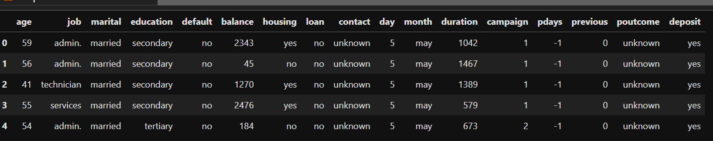
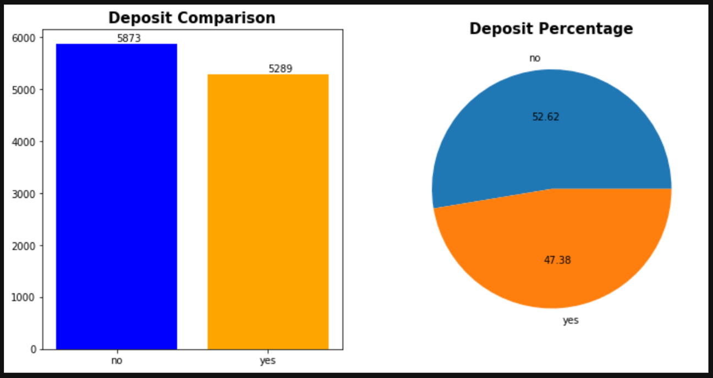
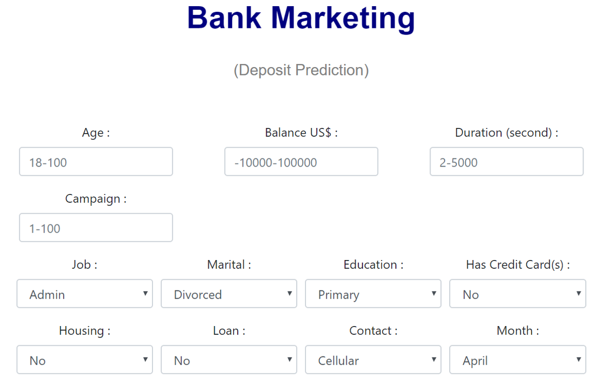
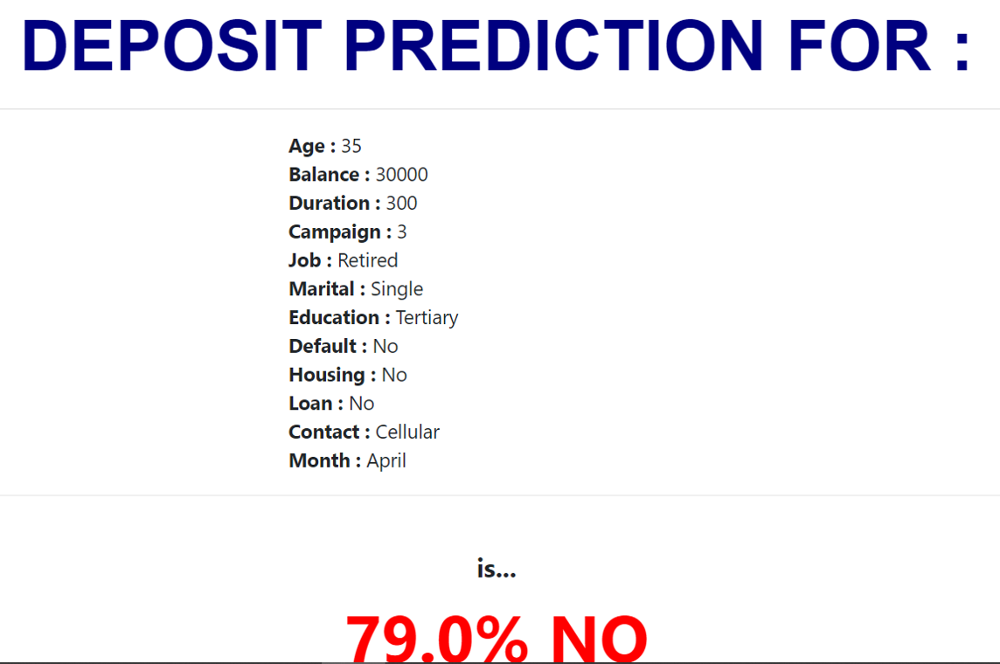

# Final_Project_Bank_Marketing
## JCDS 07 Purwadhika BSD
### Bank Marketing Classification
by : Rudy Harun Arrasyyid

Menggunakan data dari Kaggle : https://www.kaggle.com/janiobachmann/bank-marketing-dataset

Project Bank Marketing ini menggunakan dataset telemarketing dari sebuah bank di Portugal.

Project ini mencoba melakukan klasifikasi konsumen Bank berdasarkan kemungkinan membuka deposit baru atau tidak.

Dataset berjumlah 11162 dengan 16 atribut dan 1 target yaitu deposit, yes atau no.

Atribut terbagi ke dalam 2 kelompok, yaitu data pribadi dan data promo sebelumnya.

Perbandingan Deposit

Tampilan Webapps

Tampilan Halaman Hasil

